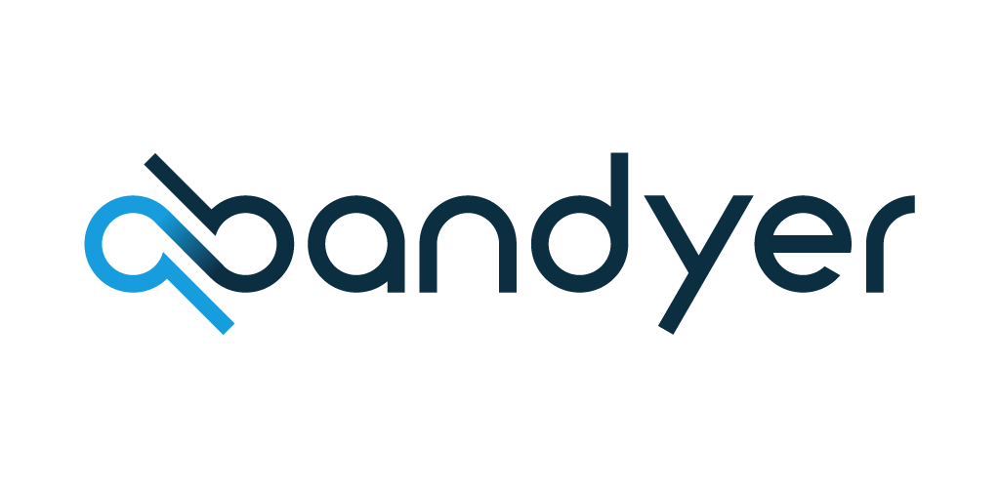

<p align="center">

</p>

[  ](https://bintray.com/bandyer/Android-CommunicationCenter/Android-CommunicationCenter/_latestVersion)[](https://bandyer.github.io/Bandyer-Android-CommunicationCenter/)[](https://twitter.com/intent/follow?screen_name=bandyersrl)


Bandyer is a young innovative startup that enables audio/video communication and collaboration from any platform and browser! Through its WebRTC architecture, it makes video communication simple and punctual. 


---

**[Requirements](#requirements)** .
**[Installation](#installation)** .
**[Quickstart](#quickstart)** .
**[Documentation](#documentation)** .
**[Support](#support)** .
**[Credits](#credits)** .

---

## Requirements

The library is supported from API level 16 (Android 4.1 Jelly Bean).

**Requires compileOptions for Java8**
```java
android {
    compileOptions {
        sourceCompatibility JavaVersion.VERSION_1_8
        targetCompatibility JavaVersion.VERSION_1_8
    }
}
```

## Installation

Download the [latest JAR](https://bintray.com/bandyer/Android-CommunicationCenter/Android-CommunicationCenter) or grab via Gradle:

```groovy
implementation 'com.bandyer:communication_center:1.2.14'
```

## Quickstart

Coming soon.

## Documentation

This sdk depends on [CoreAV SDK](https://github.com/Bandyer/Android-CoreAV)

[CommunicationCenter](https://bandyer.github.io/Bandyer-Android-CommunicationCenter/kDoc/communication_center/)

[CoreAV](https://docs.bandyer.com/Bandyer-Android-CoreAV/kDoc/core_av/)


## Support
To get basic support please submit an [Issue](https://github.com/Bandyer/Bandyer-Android-CommunicationCenter/issues) 

If you prefer commercial support, please contact [bandyer.com](https://bandyer.com) by mail: <mailto:info@bandyer.com>.


## Credits
- [WebRTC](https://webrtc.org/) by Google, Mozilla, Opera, W3C and ITF
- [Gson](https://github.com/google/gson) by Google
- [Android-weak-handler](https://github.com/badoo/android-weak-handler) by Badoo
- [Socket.io](https://github.com/socketio/socket.io-client-java) by socket.io


